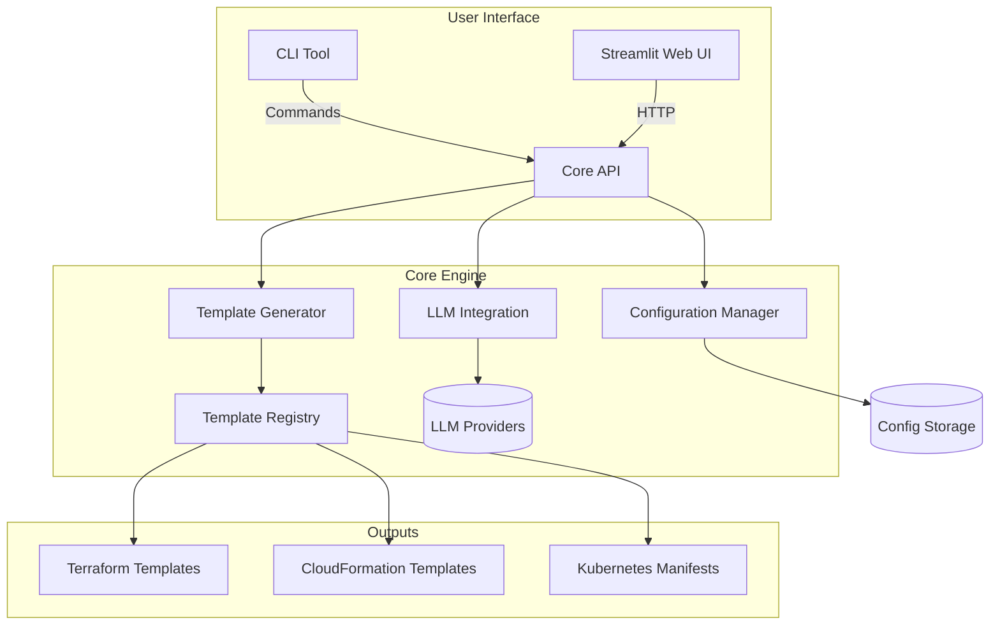
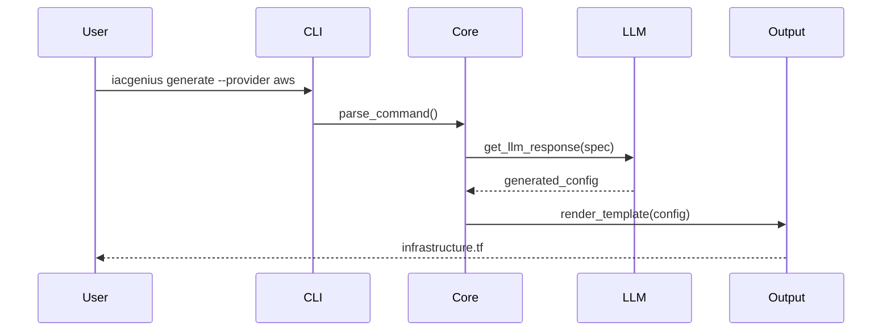

# IACGenius Architecture Overview

## System Components

## Flow Sequence

## Key Modules

### 1. CLI Interface (`cli.py`)

- Command parsing with Click
- Configuration management commands
- Web UI launch capability

### 2. Core Engine (`iacgenius/`)

- `config_handler.py`: Manage user preferences and secrets
- `generator.py`: Template rendering engine
- `llm_integration.py`: AI provider abstractions

### 3. Web Interface (`streamlit_app.py`)

- Visual template builder
- Real-time preview
- Configuration dashboard
